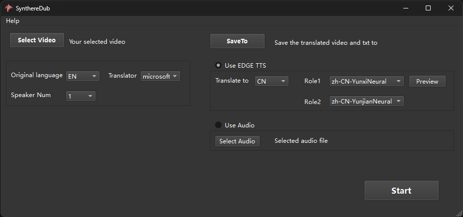

# SynthereDub: 支持参考的视频翻译工具

 
[English](README.md) | 中文
 

 
SynthereDub 将视频从一种语言的声音转译成另一种语言，使用无需注册的语音识别和翻译工具，自带edge TTS语音合成，也可使用从第三方工具合成的声音 。 
 

##  Updates

- 2024-10-30 支持使用第三方TTS生成的参考音频。

## 功能特点

Synther Dub具有以下特征：

1. **自适应对齐** 文字和速度的自适应挑战实现和原视频声音的精确对齐。 
3. **无需注册第三方工具** 使用离线语音识别whisper，集成在线免费语音合成工具edgeTTS。
4. **支持第三方转换声音** 支持选择其他来源的声音作为目的声音。

## 硬件要求

 可以在CPU或GPU上运行。CPU运行高阶版时速度较慢。若使用GPU运行，你需要至少8GB的显存；CPU运行建议16G及以上内存。

### 支持的语言

当前仅支持英文翻译至中文。

##  下载使用

* 可免费下载，无需安装点击即可使用。下载链接: https://pan.baidu.com/s/1nSZ2Qx8r9-ucEt1EFyUc5g 提取码: u54p。

## 感谢
主要依赖了以下开源项目
- [Whisper](https://github.com/openai/whisper) 
- [edge-tts](https://github.com/rany2/edge-tts)
- [FunASR](https://github.com/modelscope/FunASR)
- [moviepy](https://github.com/Zulko/moviepy)
- [PySide6](https://pypi.org/project/PySide6/)

