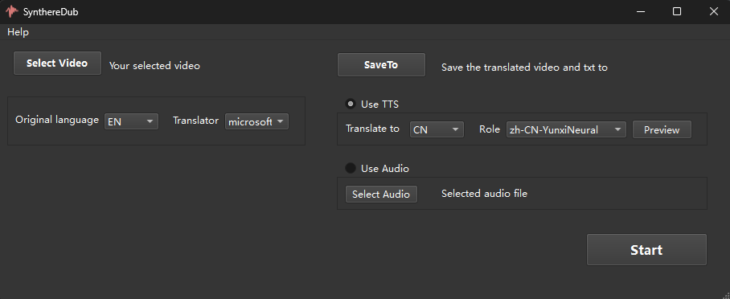

# SynthereDub: Video Dubbing tool that support using reference audio

 
[English](README.md) 
 

 
SynthereDub Translate videos from one language's voice to another using unregistered speech recognition and translation tools, with built-in edge TTS speech synthesis, and can also use voice synthesized from third-party tools.
 

##  Updates

- 2024-10-30 Support the use of reference audio generated by third-party TTS.
- 2024-11-22 Support multi-speaker video, currently 2speakers, for which different TTS voice can be set.

## Highlights

Synthere Dub has the following features:

1. **Adaptive alignment** Text and speed challenges to achieve precise alignment with the original video sound.
2. **No need to register for third-party tools** Use offline speech recognition Whisper, integrated with the free online speech synthesis tool edgeTTS.
3. **Support third-party sound conversion** Supports sound from other sources as the destination sound.
4. **Multiple speaker diarization** Supports dubbing more a video with more than 1speakers.

## Hardware requirements

 Can run on CPU or GPU. The CPU runs slower when running the advanced version. If running on a GPU, you need at least 8GB of video memory; It is recommended to use 16GB or more of memory for CPU operation.

##Supported Languages
Currently, only English to Chinese translation is supported.

##  Download and use

* It can be downloaded for free and can be used without installation or clicking. Download link: https://pan.baidu.com/s/1nSZ2Qx8r9-ucEt1EFyUc5g Extract code: u54p。

## References
Mainly relies on the following open-source projects
- [Whisper](https://github.com/openai/whisper) 
- [edge-tts](https://github.com/rany2/edge-tts)
- [FunASR](https://github.com/modelscope/FunASR)
- [moviepy](https://github.com/Zulko/moviepy)
- [PySide6](https://pypi.org/project/PySide6/)
- [Sherpa_onnx](https://github.com/k2-fsa/sherpa/tree/master)

